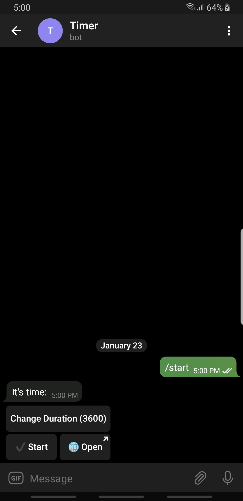
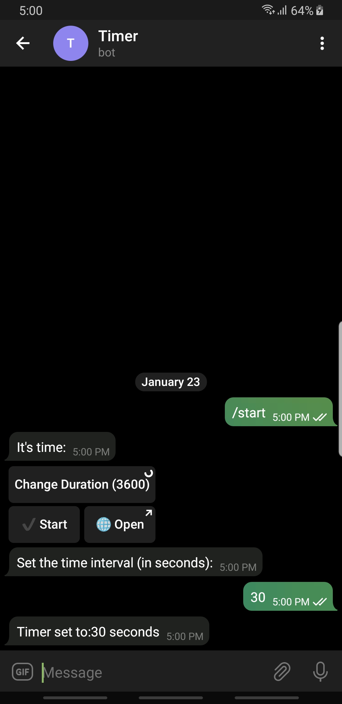
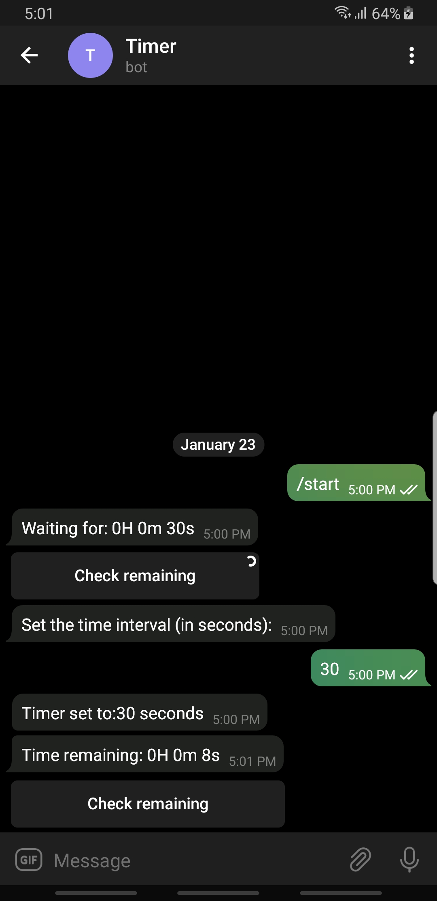
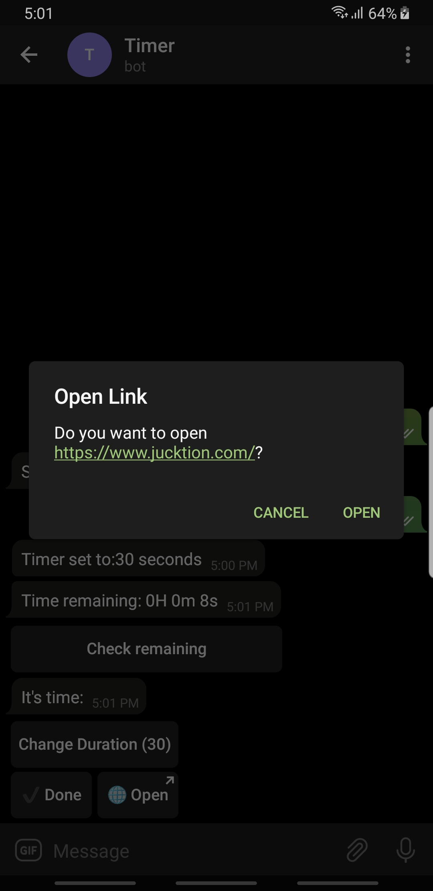

# Telegram Timer bot with PyTelegramBotAPI

This bot will help you set a timer on a device and have all your devices using Telegram notify you when the timer ends.

## Environment variables

* `TG_API` - Telegram Bot API which controls messaging

* `URL` - URL if you want to open a url when timer runs out

* `TIMER` - Timer duration for the timer

### Local Deployment

* Create a virtual environment for your bot
* Install dependencies with `pip install -r requirements.txt`
* Run the bot with `python main.py`

For local deployment or testing you can set environment variable on your OS or in an `env.py` file.

## Setup

To set this up you will need

* Telegram bot API from [BotFather](https://t.me/botfather)
* A heroku account for deployment
* Setup environment variables mentioned above in your app settings

## Commands

* `/go` - Display the timer controls
* `/set` - Set the timer (in seconds)
* `/link` - Set a valid url
* `/check` - Check the remaining/elasped time

## Deploy

# Screenshots

## Start screen

## Change the timer duration

## Check remaining time

## Open Link

